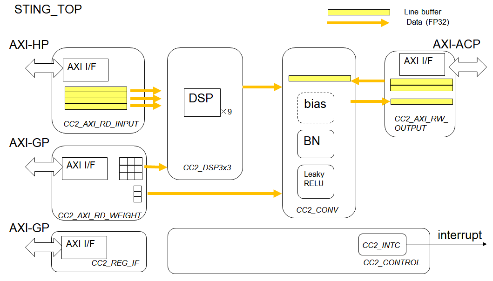
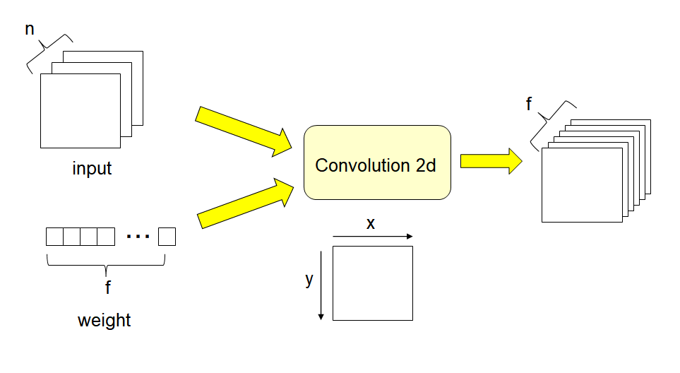
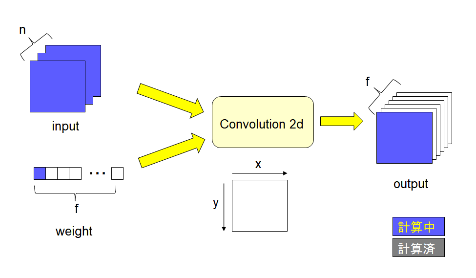
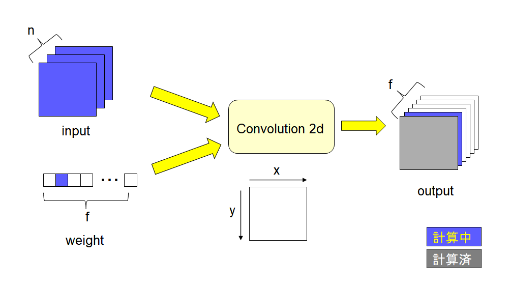
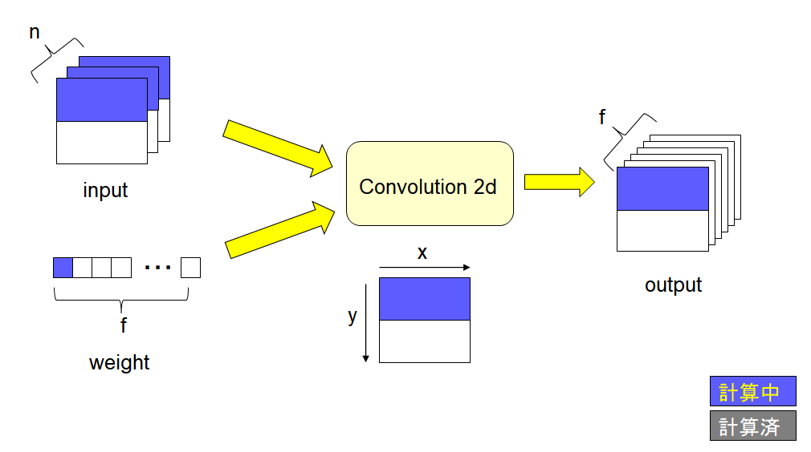
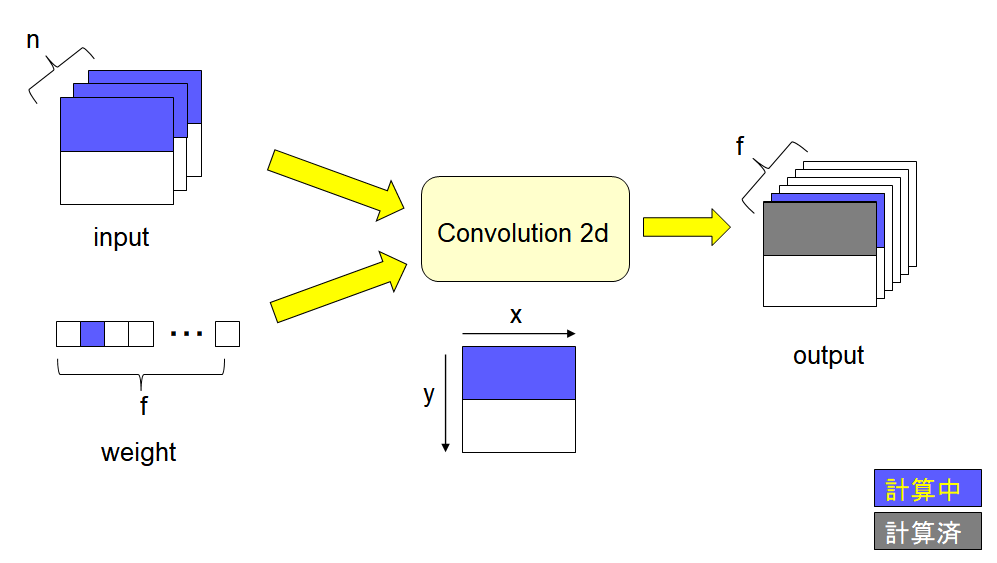
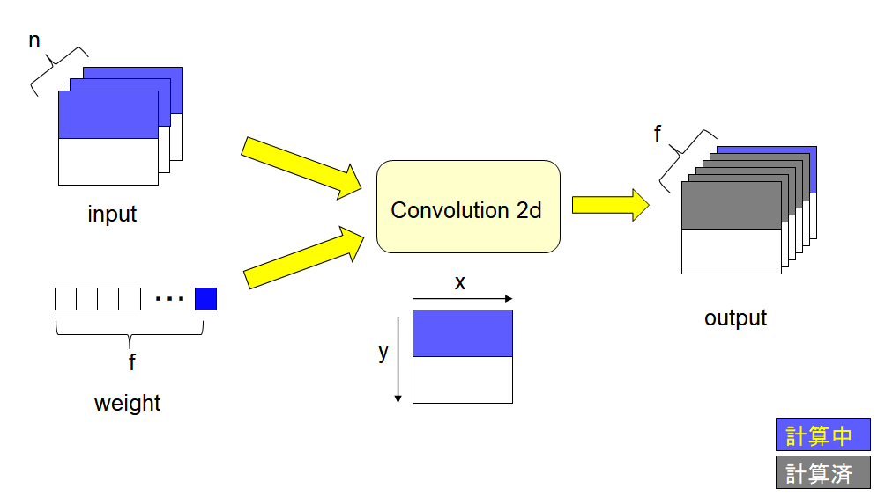
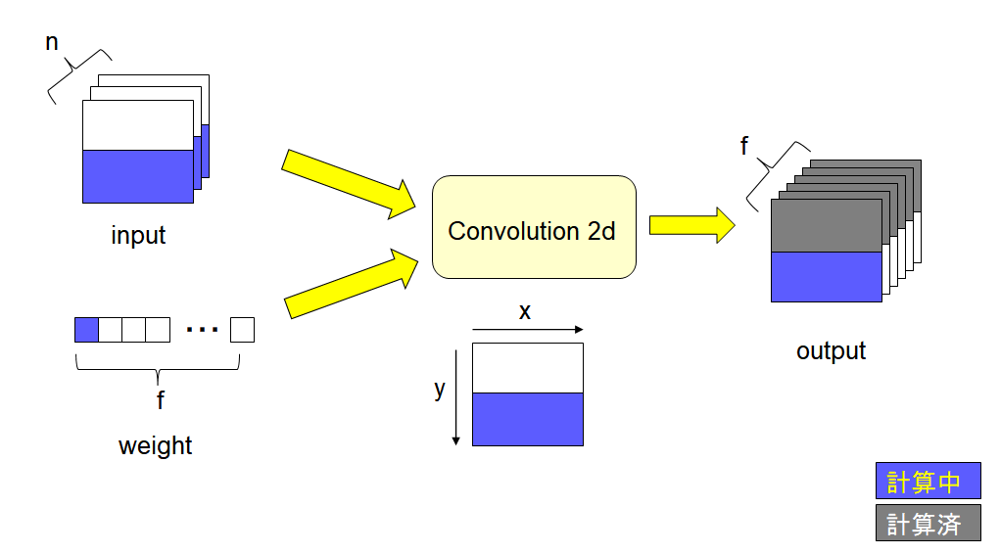
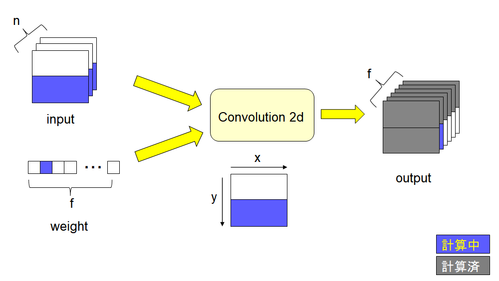

2次元コンボリューションアクセラレータ Sting仕様書
=====

# 概要
本仕様書はFPGA向け、Deep Learningで使用する2次元コンボリューションアクセラレータ Sting について記載した物である。
StingはZynq上で動作し、Deep Learningのコンボリューションと、それに続くLeakyRELU、Batch Normalizationの処理を行う。
Stingを使うことで、ARM CPU単体で実行するよりも高速にコンボリューションの計算を実行できる。

# 機能

Stingはレイヤーの計算を実行できる。

- 2次元コンボリューション
- LeakyRELU
- Batch Normalization

入力データのx方向の最大サイズは512、y方向は分割機能を使うことで無制限。入力チャネル数、フィルター数（出力チャネル数）の最大は2048。

Zynqで使用するIPコアとしては以下の機能を持つ。
- AXI_HP 1port 入力データリード用
- AXI_GP 2port レジスタR/W用、重みデータリード用
- AXI_ACP 1port 出力データR/W用
- 割り込み信号 1本
- リセット 1本
- CLK 1本

# ブロック図
Sitngのブロック図を以下に示す。



各ブロックは以下の機能を持つ。

| ブロック名|サブブロック名|機能|
|:----|:----|:----|
| STING\_TOP| - | TOP階層 |
| CC2\_REG\_IF| - | レジスタI/F|
| CC2\_CONTROL|- | 全体制御|
| |CC2\_INTC| 割り込み|
| CC2\_AXI\_RD\_INPUT |-|入力データのリード|
| CC2\_AXI\_RD\_WEIGHT |-|重みデータのリード|
| CC2\_AXI\_RW\_OUTPUT |-|出力データのR/W |
| CC2\_DSP3x3 |-|　3x3のフィルター計算|
| CC2\_CONV | - | コンボリューションの実行|
|| CC2\_BIAS | BIAS項の加算|
|| CC2\_BN |バッチノーマライゼーションの計算 |
|| CC2\_LRERU |LeakyRELUの計算 |

各ブロックの詳細はブロック仕様にて記載する。

# 動作説明
StingはCPUからのレジスタライトで起動する。高速化のために、出力データの作業メモリとしてZynq APUのL2キャッシュを想定しており、出力データのサイズにより動作を変える必要がある。L2キャッシュが512Kバイトなので、主力データがそれ以上の場合は分割実行が必要になる。Stingが分割実行をするかどうかは、実行モードによって指定する。

実行モード
- 通常モード　出力データが512Kバイト以下で使用。一回の起動で全ての計算が終了する。
- 分割モード　出力データが512Kバイト以下になるように分割して起動する。分割数と同じだけの起動が必要である。

まずは変数の定義をした後、通常モードと、分割モードでの計算順序について記述する。

## 変数定義
Stingでは計算の変数について以下の定義を使用する。変数名はコキュートスの出力Cソースと対応している。



| 変数名 | 意味 |
|:----|:----|
|n | 入力データのチャネル数。入力データがインプットレイヤーの出力の時、n=3(RGB)となる。それ以外の時は、前のレイヤーのフィルター数と同じである。 |
|f | フィルターの数、出力データのチャネル数を示す。 |
|x | 入力データのwidth方向の変数。左端を0に取る。 |
|y | 入力データのheight方向の変数。上端を0に取る。 |

## 通常モード動作
通常モードでは一回の起動で全ての処理を完了する。

はじめにf=0について全ての計算を行う。
  

次にf=1について全ての計算を行う。


以下全ての計算が終了するまでfの値を増やしていく。

## 分割モード動作時

はじめにf=0について、分割した部分の計算を行う。分割の単位はレジスタで指定する。


分割した箇所についてf=1の計算を行う。


fの最後まで計算すると割り込みが入り、stingは動作を完了する。


新しくレジスタを設定し、次の分割の単位の計算を開始させる。（f=0)


今まで同様にf=1から 最後まで順に処理を行い、最後に割り込みを発生させ動作を終了する。


# ブロック仕様

## STING\_TOP
### 機能一覧
STINGのTOP階層。

### パラメータ一覧

|group|パラメータ|デフォルト値|
|*----|----|----|
|M00_AXI|C_M00_AXI_TARGET_SLAVE_BASE_ADDR|32'h40000000|
||||
||||
||||
||||


		// Parameters of Axi Master Bus Interface M00_AXI
		parameter  	= ,
		parameter integer C_M00_AXI_BURST_LEN	= 16,
		parameter integer C_M00_AXI_ID_WIDTH	= 1,
		parameter integer C_M00_AXI_ADDR_WIDTH	= 32,
		parameter integer C_M00_AXI_DATA_WIDTH	= 32,
		parameter integer C_M00_AXI_AWUSER_WIDTH	= 0,
		parameter integer C_M00_AXI_ARUSER_WIDTH	= 0,
		parameter integer C_M00_AXI_WUSER_WIDTH	= 0,
		parameter integer C_M00_AXI_RUSER_WIDTH	= 0,
		parameter integer C_M00_AXI_BUSER_WIDTH	= 0,

		// Parameters of Axi Master Bus Interface M01_AXI
		parameter  C_M01_AXI_START_DATA_VALUE	= 32'hAA000000,
		parameter  C_M01_AXI_TARGET_SLAVE_BASE_ADDR	= 32'h40000000,
		parameter integer C_M01_AXI_ADDR_WIDTH	= 32,
		parameter integer C_M01_AXI_DATA_WIDTH	= 32,
		parameter integer C_M01_AXI_TRANSACTIONS_NUM	= 4,

		// Parameters of Axi Master Bus Interface M02_AXI
		parameter  C_M02_AXI_TARGET_SLAVE_BASE_ADDR	= 32'h40000000,
		parameter integer C_M02_AXI_BURST_LEN	= 16,
		parameter integer C_M02_AXI_ID_WIDTH	= 1,
		parameter integer C_M02_AXI_ADDR_WIDTH	= 32,
		parameter integer C_M02_AXI_DATA_WIDTH	= 32,
		parameter integer C_M02_AXI_AWUSER_WIDTH	= 0,
		parameter integer C_M02_AXI_ARUSER_WIDTH	= 0,
		parameter integer C_M02_AXI_WUSER_WIDTH	= 0,
		parameter integer C_M02_AXI_RUSER_WIDTH	= 0,
		parameter integer C_M02_AXI_BUSER_WIDTH	= 0,

		// Parameters of Axi Slave Bus Interface S00_AXI
		parameter integer C_S00_AXI_DATA_WIDTH	= 32,
		parameter integer C_S00_AXI_ADDR_WIDTH	= 8,

		// Parameters of Axi Slave Bus Interface S_AXI_INTR
		parameter integer C_S_AXI_INTR_DATA_WIDTH	= 32,
		parameter integer C_S_AXI_INTR_ADDR_WIDTH	= 5,
		parameter integer C_NUM_OF_INTR	= 1,
		parameter  C_INTR_SENSITIVITY	= 32'hFFFFFFFF,
		parameter  C_INTR_ACTIVE_STATE	= 32'hFFFFFFFF,
		parameter integer C_IRQ_SENSITIVITY	= 1,
		parameter integer C_IRQ_ACTIVE_STATE	= 1
	)


### 入出力一覧


		// Ports of Axi Master Bus Interface M00_AXI
		input wire  m00_axi_init_axi_txn,
		output wire  m00_axi_txn_done,
		output wire  m00_axi_error,
		input wire  m00_axi_aclk,
		input wire  m00_axi_aresetn,
		output wire [C_M00_AXI_ID_WIDTH-1 : 0] m00_axi_awid,
		output wire [C_M00_AXI_ADDR_WIDTH-1 : 0] m00_axi_awaddr,
		output wire [7 : 0] m00_axi_awlen,
		output wire [2 : 0] m00_axi_awsize,
		output wire [1 : 0] m00_axi_awburst,
		output wire  m00_axi_awlock,
		output wire [3 : 0] m00_axi_awcache,
		output wire [2 : 0] m00_axi_awprot,
		output wire [3 : 0] m00_axi_awqos,
		output wire [C_M00_AXI_AWUSER_WIDTH-1 : 0] m00_axi_awuser,
		output wire  m00_axi_awvalid,
		input wire  m00_axi_awready,
		output wire [C_M00_AXI_DATA_WIDTH-1 : 0] m00_axi_wdata,
		output wire [C_M00_AXI_DATA_WIDTH/8-1 : 0] m00_axi_wstrb,
		output wire  m00_axi_wlast,
		output wire [C_M00_AXI_WUSER_WIDTH-1 : 0] m00_axi_wuser,
		output wire  m00_axi_wvalid,
		input wire  m00_axi_wready,
		input wire [C_M00_AXI_ID_WIDTH-1 : 0] m00_axi_bid,
		input wire [1 : 0] m00_axi_bresp,
		input wire [C_M00_AXI_BUSER_WIDTH-1 : 0] m00_axi_buser,
		input wire  m00_axi_bvalid,
		output wire  m00_axi_bready,
		output wire [C_M00_AXI_ID_WIDTH-1 : 0] m00_axi_arid,
		output wire [C_M00_AXI_ADDR_WIDTH-1 : 0] m00_axi_araddr,
		output wire [7 : 0] m00_axi_arlen,
		output wire [2 : 0] m00_axi_arsize,
		output wire [1 : 0] m00_axi_arburst,
		output wire  m00_axi_arlock,
		output wire [3 : 0] m00_axi_arcache,
		output wire [2 : 0] m00_axi_arprot,
		output wire [3 : 0] m00_axi_arqos,
		output wire [C_M00_AXI_ARUSER_WIDTH-1 : 0] m00_axi_aruser,
		output wire  m00_axi_arvalid,
		input wire  m00_axi_arready,
		input wire [C_M00_AXI_ID_WIDTH-1 : 0] m00_axi_rid,
		input wire [C_M00_AXI_DATA_WIDTH-1 : 0] m00_axi_rdata,
		input wire [1 : 0] m00_axi_rresp,
		input wire  m00_axi_rlast,
		input wire [C_M00_AXI_RUSER_WIDTH-1 : 0] m00_axi_ruser,
		input wire  m00_axi_rvalid,
		output wire  m00_axi_rready,

		// Ports of Axi Master Bus Interface M01_AXI
		input wire  m01_axi_init_axi_txn,
		output wire  m01_axi_error,
		output wire  m01_axi_txn_done,
		input wire  m01_axi_aclk,
		input wire  m01_axi_aresetn,
		output wire [C_M01_AXI_ADDR_WIDTH-1 : 0] m01_axi_awaddr,
		output wire [2 : 0] m01_axi_awprot,
		output wire  m01_axi_awvalid,
		input wire  m01_axi_awready,
		output wire [C_M01_AXI_DATA_WIDTH-1 : 0] m01_axi_wdata,
		output wire [C_M01_AXI_DATA_WIDTH/8-1 : 0] m01_axi_wstrb,
		output wire  m01_axi_wvalid,
		input wire  m01_axi_wready,
		input wire [1 : 0] m01_axi_bresp,
		input wire  m01_axi_bvalid,
		output wire  m01_axi_bready,
		output wire [C_M01_AXI_ADDR_WIDTH-1 : 0] m01_axi_araddr,
		output wire [2 : 0] m01_axi_arprot,
		output wire  m01_axi_arvalid,
		input wire  m01_axi_arready,
		input wire [C_M01_AXI_DATA_WIDTH-1 : 0] m01_axi_rdata,
		input wire [1 : 0] m01_axi_rresp,
		input wire  m01_axi_rvalid,
		output wire  m01_axi_rready,

		// Ports of Axi Master Bus Interface M02_AXI
		input wire  m02_axi_init_axi_txn,
		output wire  m02_axi_txn_done,
		output wire  m02_axi_error,
		input wire  m02_axi_aclk,
		input wire  m02_axi_aresetn,
		output wire [C_M02_AXI_ID_WIDTH-1 : 0] m02_axi_awid,
		output wire [C_M02_AXI_ADDR_WIDTH-1 : 0] m02_axi_awaddr,
		output wire [7 : 0] m02_axi_awlen,
		output wire [2 : 0] m02_axi_awsize,
		output wire [1 : 0] m02_axi_awburst,
		output wire  m02_axi_awlock,
		output wire [3 : 0] m02_axi_awcache,
		output wire [2 : 0] m02_axi_awprot,
		output wire [3 : 0] m02_axi_awqos,
		output wire [C_M02_AXI_AWUSER_WIDTH-1 : 0] m02_axi_awuser,
		output wire  m02_axi_awvalid,
		input wire  m02_axi_awready,
		output wire [C_M02_AXI_DATA_WIDTH-1 : 0] m02_axi_wdata,
		output wire [C_M02_AXI_DATA_WIDTH/8-1 : 0] m02_axi_wstrb,
		output wire  m02_axi_wlast,
		output wire [C_M02_AXI_WUSER_WIDTH-1 : 0] m02_axi_wuser,
		output wire  m02_axi_wvalid,
		input wire  m02_axi_wready,
		input wire [C_M02_AXI_ID_WIDTH-1 : 0] m02_axi_bid,
		input wire [1 : 0] m02_axi_bresp,
		input wire [C_M02_AXI_BUSER_WIDTH-1 : 0] m02_axi_buser,
		input wire  m02_axi_bvalid,
		output wire  m02_axi_bready,
		output wire [C_M02_AXI_ID_WIDTH-1 : 0] m02_axi_arid,
		output wire [C_M02_AXI_ADDR_WIDTH-1 : 0] m02_axi_araddr,
		output wire [7 : 0] m02_axi_arlen,
		output wire [2 : 0] m02_axi_arsize,
		output wire [1 : 0] m02_axi_arburst,
		output wire  m02_axi_arlock,
		output wire [3 : 0] m02_axi_arcache,
		output wire [2 : 0] m02_axi_arprot,
		output wire [3 : 0] m02_axi_arqos,
		output wire [C_M02_AXI_ARUSER_WIDTH-1 : 0] m02_axi_aruser,
		output wire  m02_axi_arvalid,
		input wire  m02_axi_arready,
		input wire [C_M02_AXI_ID_WIDTH-1 : 0] m02_axi_rid,
		input wire [C_M02_AXI_DATA_WIDTH-1 : 0] m02_axi_rdata,
		input wire [1 : 0] m02_axi_rresp,
		input wire  m02_axi_rlast,
		input wire [C_M02_AXI_RUSER_WIDTH-1 : 0] m02_axi_ruser,
		input wire  m02_axi_rvalid,
		output wire  m02_axi_rready,

		// Ports of Axi Slave Bus Interface S00_AXI
		input wire  s00_axi_aclk,
		input wire  s00_axi_aresetn,
		input wire [C_S00_AXI_ADDR_WIDTH-1 : 0] s00_axi_awaddr,
		input wire [2 : 0] s00_axi_awprot,
		input wire  s00_axi_awvalid,
		output wire  s00_axi_awready,
		input wire [C_S00_AXI_DATA_WIDTH-1 : 0] s00_axi_wdata,
		input wire [(C_S00_AXI_DATA_WIDTH/8)-1 : 0] s00_axi_wstrb,
		input wire  s00_axi_wvalid,
		output wire  s00_axi_wready,
		output wire [1 : 0] s00_axi_bresp,
		output wire  s00_axi_bvalid,
		input wire  s00_axi_bready,
		input wire [C_S00_AXI_ADDR_WIDTH-1 : 0] s00_axi_araddr,
		input wire [2 : 0] s00_axi_arprot,
		input wire  s00_axi_arvalid,
		output wire  s00_axi_arready,
		output wire [C_S00_AXI_DATA_WIDTH-1 : 0] s00_axi_rdata,
		output wire [1 : 0] s00_axi_rresp,
		output wire  s00_axi_rvalid,
		input wire  s00_axi_rready,

		// Ports of Axi Slave Bus Interface S_AXI_INTR
		input wire  s_axi_intr_aclk,
		input wire  s_axi_intr_aresetn,
		input wire [C_S_AXI_INTR_ADDR_WIDTH-1 : 0] s_axi_intr_awaddr,
		input wire [2 : 0] s_axi_intr_awprot,
		input wire  s_axi_intr_awvalid,
		output wire  s_axi_intr_awready,
		input wire [C_S_AXI_INTR_DATA_WIDTH-1 : 0] s_axi_intr_wdata,
		input wire [(C_S_AXI_INTR_DATA_WIDTH/8)-1 : 0] s_axi_intr_wstrb,
		input wire  s_axi_intr_wvalid,
		output wire  s_axi_intr_wready,
		output wire [1 : 0] s_axi_intr_bresp,
		output wire  s_axi_intr_bvalid,
		input wire  s_axi_intr_bready,
		input wire [C_S_AXI_INTR_ADDR_WIDTH-1 : 0] s_axi_intr_araddr,
		input wire [2 : 0] s_axi_intr_arprot,
		input wire  s_axi_intr_arvalid,
		output wire  s_axi_intr_arready,
		output wire [C_S_AXI_INTR_DATA_WIDTH-1 : 0] s_axi_intr_rdata,
		output wire [1 : 0] s_axi_intr_rresp,
		output wire  s_axi_intr_rvalid,
		input wire  s_axi_intr_rready,
		output wire  irq
	);


## CC2\_REG\_IF
## CC2\_CONTROL
## CC2\_AXI\_RD\_INPUT
## CC2\_AXI\_RD\_WEIGHT
## CC2\_AXI\_RW\_OUTPUT
## CC2\_DSP3x3
## CC2\_CONV

# レジスタ一覧

# リファレンス


# rtl
```

`timescale 1 ns / 1 ps

	module sting_wrap_v1_0 #
	(
		// Users to add parameters here

		// User parameters ends
		// Do not modify the parameters beyond this line


		// Parameters of Axi Master Bus Interface M00_AXI
		parameter  C_M00_AXI_TARGET_SLAVE_BASE_ADDR	= 32'h40000000,
		parameter integer C_M00_AXI_BURST_LEN	= 16,
		parameter integer C_M00_AXI_ID_WIDTH	= 1,
		parameter integer C_M00_AXI_ADDR_WIDTH	= 32,
		parameter integer C_M00_AXI_DATA_WIDTH	= 32,
		parameter integer C_M00_AXI_AWUSER_WIDTH	= 0,
		parameter integer C_M00_AXI_ARUSER_WIDTH	= 0,
		parameter integer C_M00_AXI_WUSER_WIDTH	= 0,
		parameter integer C_M00_AXI_RUSER_WIDTH	= 0,
		parameter integer C_M00_AXI_BUSER_WIDTH	= 0,

		// Parameters of Axi Master Bus Interface M01_AXI
		parameter  C_M01_AXI_START_DATA_VALUE	= 32'hAA000000,
		parameter  C_M01_AXI_TARGET_SLAVE_BASE_ADDR	= 32'h40000000,
		parameter integer C_M01_AXI_ADDR_WIDTH	= 32,
		parameter integer C_M01_AXI_DATA_WIDTH	= 32,
		parameter integer C_M01_AXI_TRANSACTIONS_NUM	= 4,

		// Parameters of Axi Master Bus Interface M02_AXI
		parameter  C_M02_AXI_TARGET_SLAVE_BASE_ADDR	= 32'h40000000,
		parameter integer C_M02_AXI_BURST_LEN	= 16,
		parameter integer C_M02_AXI_ID_WIDTH	= 1,
		parameter integer C_M02_AXI_ADDR_WIDTH	= 32,
		parameter integer C_M02_AXI_DATA_WIDTH	= 32,
		parameter integer C_M02_AXI_AWUSER_WIDTH	= 0,
		parameter integer C_M02_AXI_ARUSER_WIDTH	= 0,
		parameter integer C_M02_AXI_WUSER_WIDTH	= 0,
		parameter integer C_M02_AXI_RUSER_WIDTH	= 0,
		parameter integer C_M02_AXI_BUSER_WIDTH	= 0,

		// Parameters of Axi Slave Bus Interface S00_AXI
		parameter integer C_S00_AXI_DATA_WIDTH	= 32,
		parameter integer C_S00_AXI_ADDR_WIDTH	= 8,

		// Parameters of Axi Slave Bus Interface S_AXI_INTR
		parameter integer C_S_AXI_INTR_DATA_WIDTH	= 32,
		parameter integer C_S_AXI_INTR_ADDR_WIDTH	= 5,
		parameter integer C_NUM_OF_INTR	= 1,
		parameter  C_INTR_SENSITIVITY	= 32'hFFFFFFFF,
		parameter  C_INTR_ACTIVE_STATE	= 32'hFFFFFFFF,
		parameter integer C_IRQ_SENSITIVITY	= 1,
		parameter integer C_IRQ_ACTIVE_STATE	= 1
	)
	(
		// Users to add ports here

		// User ports ends
		// Do not modify the ports beyond this line


		// Ports of Axi Master Bus Interface M00_AXI
		input wire  m00_axi_init_axi_txn,
		output wire  m00_axi_txn_done,
		output wire  m00_axi_error,
		input wire  m00_axi_aclk,
		input wire  m00_axi_aresetn,
		output wire [C_M00_AXI_ID_WIDTH-1 : 0] m00_axi_awid,
		output wire [C_M00_AXI_ADDR_WIDTH-1 : 0] m00_axi_awaddr,
		output wire [7 : 0] m00_axi_awlen,
		output wire [2 : 0] m00_axi_awsize,
		output wire [1 : 0] m00_axi_awburst,
		output wire  m00_axi_awlock,
		output wire [3 : 0] m00_axi_awcache,
		output wire [2 : 0] m00_axi_awprot,
		output wire [3 : 0] m00_axi_awqos,
		output wire [C_M00_AXI_AWUSER_WIDTH-1 : 0] m00_axi_awuser,
		output wire  m00_axi_awvalid,
		input wire  m00_axi_awready,
		output wire [C_M00_AXI_DATA_WIDTH-1 : 0] m00_axi_wdata,
		output wire [C_M00_AXI_DATA_WIDTH/8-1 : 0] m00_axi_wstrb,
		output wire  m00_axi_wlast,
		output wire [C_M00_AXI_WUSER_WIDTH-1 : 0] m00_axi_wuser,
		output wire  m00_axi_wvalid,
		input wire  m00_axi_wready,
		input wire [C_M00_AXI_ID_WIDTH-1 : 0] m00_axi_bid,
		input wire [1 : 0] m00_axi_bresp,
		input wire [C_M00_AXI_BUSER_WIDTH-1 : 0] m00_axi_buser,
		input wire  m00_axi_bvalid,
		output wire  m00_axi_bready,
		output wire [C_M00_AXI_ID_WIDTH-1 : 0] m00_axi_arid,
		output wire [C_M00_AXI_ADDR_WIDTH-1 : 0] m00_axi_araddr,
		output wire [7 : 0] m00_axi_arlen,
		output wire [2 : 0] m00_axi_arsize,
		output wire [1 : 0] m00_axi_arburst,
		output wire  m00_axi_arlock,
		output wire [3 : 0] m00_axi_arcache,
		output wire [2 : 0] m00_axi_arprot,
		output wire [3 : 0] m00_axi_arqos,
		output wire [C_M00_AXI_ARUSER_WIDTH-1 : 0] m00_axi_aruser,
		output wire  m00_axi_arvalid,
		input wire  m00_axi_arready,
		input wire [C_M00_AXI_ID_WIDTH-1 : 0] m00_axi_rid,
		input wire [C_M00_AXI_DATA_WIDTH-1 : 0] m00_axi_rdata,
		input wire [1 : 0] m00_axi_rresp,
		input wire  m00_axi_rlast,
		input wire [C_M00_AXI_RUSER_WIDTH-1 : 0] m00_axi_ruser,
		input wire  m00_axi_rvalid,
		output wire  m00_axi_rready,

		// Ports of Axi Master Bus Interface M01_AXI
		input wire  m01_axi_init_axi_txn,
		output wire  m01_axi_error,
		output wire  m01_axi_txn_done,
		input wire  m01_axi_aclk,
		input wire  m01_axi_aresetn,
		output wire [C_M01_AXI_ADDR_WIDTH-1 : 0] m01_axi_awaddr,
		output wire [2 : 0] m01_axi_awprot,
		output wire  m01_axi_awvalid,
		input wire  m01_axi_awready,
		output wire [C_M01_AXI_DATA_WIDTH-1 : 0] m01_axi_wdata,
		output wire [C_M01_AXI_DATA_WIDTH/8-1 : 0] m01_axi_wstrb,
		output wire  m01_axi_wvalid,
		input wire  m01_axi_wready,
		input wire [1 : 0] m01_axi_bresp,
		input wire  m01_axi_bvalid,
		output wire  m01_axi_bready,
		output wire [C_M01_AXI_ADDR_WIDTH-1 : 0] m01_axi_araddr,
		output wire [2 : 0] m01_axi_arprot,
		output wire  m01_axi_arvalid,
		input wire  m01_axi_arready,
		input wire [C_M01_AXI_DATA_WIDTH-1 : 0] m01_axi_rdata,
		input wire [1 : 0] m01_axi_rresp,
		input wire  m01_axi_rvalid,
		output wire  m01_axi_rready,

		// Ports of Axi Master Bus Interface M02_AXI
		input wire  m02_axi_init_axi_txn,
		output wire  m02_axi_txn_done,
		output wire  m02_axi_error,
		input wire  m02_axi_aclk,
		input wire  m02_axi_aresetn,
		output wire [C_M02_AXI_ID_WIDTH-1 : 0] m02_axi_awid,
		output wire [C_M02_AXI_ADDR_WIDTH-1 : 0] m02_axi_awaddr,
		output wire [7 : 0] m02_axi_awlen,
		output wire [2 : 0] m02_axi_awsize,
		output wire [1 : 0] m02_axi_awburst,
		output wire  m02_axi_awlock,
		output wire [3 : 0] m02_axi_awcache,
		output wire [2 : 0] m02_axi_awprot,
		output wire [3 : 0] m02_axi_awqos,
		output wire [C_M02_AXI_AWUSER_WIDTH-1 : 0] m02_axi_awuser,
		output wire  m02_axi_awvalid,
		input wire  m02_axi_awready,
		output wire [C_M02_AXI_DATA_WIDTH-1 : 0] m02_axi_wdata,
		output wire [C_M02_AXI_DATA_WIDTH/8-1 : 0] m02_axi_wstrb,
		output wire  m02_axi_wlast,
		output wire [C_M02_AXI_WUSER_WIDTH-1 : 0] m02_axi_wuser,
		output wire  m02_axi_wvalid,
		input wire  m02_axi_wready,
		input wire [C_M02_AXI_ID_WIDTH-1 : 0] m02_axi_bid,
		input wire [1 : 0] m02_axi_bresp,
		input wire [C_M02_AXI_BUSER_WIDTH-1 : 0] m02_axi_buser,
		input wire  m02_axi_bvalid,
		output wire  m02_axi_bready,
		output wire [C_M02_AXI_ID_WIDTH-1 : 0] m02_axi_arid,
		output wire [C_M02_AXI_ADDR_WIDTH-1 : 0] m02_axi_araddr,
		output wire [7 : 0] m02_axi_arlen,
		output wire [2 : 0] m02_axi_arsize,
		output wire [1 : 0] m02_axi_arburst,
		output wire  m02_axi_arlock,
		output wire [3 : 0] m02_axi_arcache,
		output wire [2 : 0] m02_axi_arprot,
		output wire [3 : 0] m02_axi_arqos,
		output wire [C_M02_AXI_ARUSER_WIDTH-1 : 0] m02_axi_aruser,
		output wire  m02_axi_arvalid,
		input wire  m02_axi_arready,
		input wire [C_M02_AXI_ID_WIDTH-1 : 0] m02_axi_rid,
		input wire [C_M02_AXI_DATA_WIDTH-1 : 0] m02_axi_rdata,
		input wire [1 : 0] m02_axi_rresp,
		input wire  m02_axi_rlast,
		input wire [C_M02_AXI_RUSER_WIDTH-1 : 0] m02_axi_ruser,
		input wire  m02_axi_rvalid,
		output wire  m02_axi_rready,

		// Ports of Axi Slave Bus Interface S00_AXI
		input wire  s00_axi_aclk,
		input wire  s00_axi_aresetn,
		input wire [C_S00_AXI_ADDR_WIDTH-1 : 0] s00_axi_awaddr,
		input wire [2 : 0] s00_axi_awprot,
		input wire  s00_axi_awvalid,
		output wire  s00_axi_awready,
		input wire [C_S00_AXI_DATA_WIDTH-1 : 0] s00_axi_wdata,
		input wire [(C_S00_AXI_DATA_WIDTH/8)-1 : 0] s00_axi_wstrb,
		input wire  s00_axi_wvalid,
		output wire  s00_axi_wready,
		output wire [1 : 0] s00_axi_bresp,
		output wire  s00_axi_bvalid,
		input wire  s00_axi_bready,
		input wire [C_S00_AXI_ADDR_WIDTH-1 : 0] s00_axi_araddr,
		input wire [2 : 0] s00_axi_arprot,
		input wire  s00_axi_arvalid,
		output wire  s00_axi_arready,
		output wire [C_S00_AXI_DATA_WIDTH-1 : 0] s00_axi_rdata,
		output wire [1 : 0] s00_axi_rresp,
		output wire  s00_axi_rvalid,
		input wire  s00_axi_rready,

		// Ports of Axi Slave Bus Interface S_AXI_INTR
		input wire  s_axi_intr_aclk,
		input wire  s_axi_intr_aresetn,
		input wire [C_S_AXI_INTR_ADDR_WIDTH-1 : 0] s_axi_intr_awaddr,
		input wire [2 : 0] s_axi_intr_awprot,
		input wire  s_axi_intr_awvalid,
		output wire  s_axi_intr_awready,
		input wire [C_S_AXI_INTR_DATA_WIDTH-1 : 0] s_axi_intr_wdata,
		input wire [(C_S_AXI_INTR_DATA_WIDTH/8)-1 : 0] s_axi_intr_wstrb,
		input wire  s_axi_intr_wvalid,
		output wire  s_axi_intr_wready,
		output wire [1 : 0] s_axi_intr_bresp,
		output wire  s_axi_intr_bvalid,
		input wire  s_axi_intr_bready,
		input wire [C_S_AXI_INTR_ADDR_WIDTH-1 : 0] s_axi_intr_araddr,
		input wire [2 : 0] s_axi_intr_arprot,
		input wire  s_axi_intr_arvalid,
		output wire  s_axi_intr_arready,
		output wire [C_S_AXI_INTR_DATA_WIDTH-1 : 0] s_axi_intr_rdata,
		output wire [1 : 0] s_axi_intr_rresp,
		output wire  s_axi_intr_rvalid,
		input wire  s_axi_intr_rready,
		output wire  irq
	);
// Instantiation of Axi Bus Interface M00_AXI
	sting_wrap_v1_0_M00_AXI # ( 
		.C_M_TARGET_SLAVE_BASE_ADDR(C_M00_AXI_TARGET_SLAVE_BASE_ADDR),
		.C_M_AXI_BURST_LEN(C_M00_AXI_BURST_LEN),
		.C_M_AXI_ID_WIDTH(C_M00_AXI_ID_WIDTH),
		.C_M_AXI_ADDR_WIDTH(C_M00_AXI_ADDR_WIDTH),
		.C_M_AXI_DATA_WIDTH(C_M00_AXI_DATA_WIDTH),
		.C_M_AXI_AWUSER_WIDTH(C_M00_AXI_AWUSER_WIDTH),
		.C_M_AXI_ARUSER_WIDTH(C_M00_AXI_ARUSER_WIDTH),
		.C_M_AXI_WUSER_WIDTH(C_M00_AXI_WUSER_WIDTH),
		.C_M_AXI_RUSER_WIDTH(C_M00_AXI_RUSER_WIDTH),
		.C_M_AXI_BUSER_WIDTH(C_M00_AXI_BUSER_WIDTH)
	) sting_wrap_v1_0_M00_AXI_inst (
		.INIT_AXI_TXN(m00_axi_init_axi_txn),
		.TXN_DONE(m00_axi_txn_done),
		.ERROR(m00_axi_error),
		.M_AXI_ACLK(m00_axi_aclk),
		.M_AXI_ARESETN(m00_axi_aresetn),
		.M_AXI_AWID(m00_axi_awid),
		.M_AXI_AWADDR(m00_axi_awaddr),
		.M_AXI_AWLEN(m00_axi_awlen),
		.M_AXI_AWSIZE(m00_axi_awsize),
		.M_AXI_AWBURST(m00_axi_awburst),
		.M_AXI_AWLOCK(m00_axi_awlock),
		.M_AXI_AWCACHE(m00_axi_awcache),
		.M_AXI_AWPROT(m00_axi_awprot),
		.M_AXI_AWQOS(m00_axi_awqos),
		.M_AXI_AWUSER(m00_axi_awuser),
		.M_AXI_AWVALID(m00_axi_awvalid),
		.M_AXI_AWREADY(m00_axi_awready),
		.M_AXI_WDATA(m00_axi_wdata),
		.M_AXI_WSTRB(m00_axi_wstrb),
		.M_AXI_WLAST(m00_axi_wlast),
		.M_AXI_WUSER(m00_axi_wuser),
		.M_AXI_WVALID(m00_axi_wvalid),
		.M_AXI_WREADY(m00_axi_wready),
		.M_AXI_BID(m00_axi_bid),
		.M_AXI_BRESP(m00_axi_bresp),
		.M_AXI_BUSER(m00_axi_buser),
		.M_AXI_BVALID(m00_axi_bvalid),
		.M_AXI_BREADY(m00_axi_bready),
		.M_AXI_ARID(m00_axi_arid),
		.M_AXI_ARADDR(m00_axi_araddr),
		.M_AXI_ARLEN(m00_axi_arlen),
		.M_AXI_ARSIZE(m00_axi_arsize),
		.M_AXI_ARBURST(m00_axi_arburst),
		.M_AXI_ARLOCK(m00_axi_arlock),
		.M_AXI_ARCACHE(m00_axi_arcache),
		.M_AXI_ARPROT(m00_axi_arprot),
		.M_AXI_ARQOS(m00_axi_arqos),
		.M_AXI_ARUSER(m00_axi_aruser),
		.M_AXI_ARVALID(m00_axi_arvalid),
		.M_AXI_ARREADY(m00_axi_arready),
		.M_AXI_RID(m00_axi_rid),
		.M_AXI_RDATA(m00_axi_rdata),
		.M_AXI_RRESP(m00_axi_rresp),
		.M_AXI_RLAST(m00_axi_rlast),
		.M_AXI_RUSER(m00_axi_ruser),
		.M_AXI_RVALID(m00_axi_rvalid),
		.M_AXI_RREADY(m00_axi_rready)
	);

// Instantiation of Axi Bus Interface M01_AXI
	sting_wrap_v1_0_M01_AXI # ( 
		.C_M_START_DATA_VALUE(C_M01_AXI_START_DATA_VALUE),
		.C_M_TARGET_SLAVE_BASE_ADDR(C_M01_AXI_TARGET_SLAVE_BASE_ADDR),
		.C_M_AXI_ADDR_WIDTH(C_M01_AXI_ADDR_WIDTH),
		.C_M_AXI_DATA_WIDTH(C_M01_AXI_DATA_WIDTH),
		.C_M_TRANSACTIONS_NUM(C_M01_AXI_TRANSACTIONS_NUM)
	) sting_wrap_v1_0_M01_AXI_inst (
		.INIT_AXI_TXN(m01_axi_init_axi_txn),
		.ERROR(m01_axi_error),
		.TXN_DONE(m01_axi_txn_done),
		.M_AXI_ACLK(m01_axi_aclk),
		.M_AXI_ARESETN(m01_axi_aresetn),
		.M_AXI_AWADDR(m01_axi_awaddr),
		.M_AXI_AWPROT(m01_axi_awprot),
		.M_AXI_AWVALID(m01_axi_awvalid),
		.M_AXI_AWREADY(m01_axi_awready),
		.M_AXI_WDATA(m01_axi_wdata),
		.M_AXI_WSTRB(m01_axi_wstrb),
		.M_AXI_WVALID(m01_axi_wvalid),
		.M_AXI_WREADY(m01_axi_wready),
		.M_AXI_BRESP(m01_axi_bresp),
		.M_AXI_BVALID(m01_axi_bvalid),
		.M_AXI_BREADY(m01_axi_bready),
		.M_AXI_ARADDR(m01_axi_araddr),
		.M_AXI_ARPROT(m01_axi_arprot),
		.M_AXI_ARVALID(m01_axi_arvalid),
		.M_AXI_ARREADY(m01_axi_arready),
		.M_AXI_RDATA(m01_axi_rdata),
		.M_AXI_RRESP(m01_axi_rresp),
		.M_AXI_RVALID(m01_axi_rvalid),
		.M_AXI_RREADY(m01_axi_rready)
	);

// Instantiation of Axi Bus Interface M02_AXI
	sting_wrap_v1_0_M02_AXI # ( 
		.C_M_TARGET_SLAVE_BASE_ADDR(C_M02_AXI_TARGET_SLAVE_BASE_ADDR),
		.C_M_AXI_BURST_LEN(C_M02_AXI_BURST_LEN),
		.C_M_AXI_ID_WIDTH(C_M02_AXI_ID_WIDTH),
		.C_M_AXI_ADDR_WIDTH(C_M02_AXI_ADDR_WIDTH),
		.C_M_AXI_DATA_WIDTH(C_M02_AXI_DATA_WIDTH),
		.C_M_AXI_AWUSER_WIDTH(C_M02_AXI_AWUSER_WIDTH),
		.C_M_AXI_ARUSER_WIDTH(C_M02_AXI_ARUSER_WIDTH),
		.C_M_AXI_WUSER_WIDTH(C_M02_AXI_WUSER_WIDTH),
		.C_M_AXI_RUSER_WIDTH(C_M02_AXI_RUSER_WIDTH),
		.C_M_AXI_BUSER_WIDTH(C_M02_AXI_BUSER_WIDTH)
	) sting_wrap_v1_0_M02_AXI_inst (
		.INIT_AXI_TXN(m02_axi_init_axi_txn),
		.TXN_DONE(m02_axi_txn_done),
		.ERROR(m02_axi_error),
		.M_AXI_ACLK(m02_axi_aclk),
		.M_AXI_ARESETN(m02_axi_aresetn),
		.M_AXI_AWID(m02_axi_awid),
		.M_AXI_AWADDR(m02_axi_awaddr),
		.M_AXI_AWLEN(m02_axi_awlen),
		.M_AXI_AWSIZE(m02_axi_awsize),
		.M_AXI_AWBURST(m02_axi_awburst),
		.M_AXI_AWLOCK(m02_axi_awlock),
		.M_AXI_AWCACHE(m02_axi_awcache),
		.M_AXI_AWPROT(m02_axi_awprot),
		.M_AXI_AWQOS(m02_axi_awqos),
		.M_AXI_AWUSER(m02_axi_awuser),
		.M_AXI_AWVALID(m02_axi_awvalid),
		.M_AXI_AWREADY(m02_axi_awready),
		.M_AXI_WDATA(m02_axi_wdata),
		.M_AXI_WSTRB(m02_axi_wstrb),
		.M_AXI_WLAST(m02_axi_wlast),
		.M_AXI_WUSER(m02_axi_wuser),
		.M_AXI_WVALID(m02_axi_wvalid),
		.M_AXI_WREADY(m02_axi_wready),
		.M_AXI_BID(m02_axi_bid),
		.M_AXI_BRESP(m02_axi_bresp),
		.M_AXI_BUSER(m02_axi_buser),
		.M_AXI_BVALID(m02_axi_bvalid),
		.M_AXI_BREADY(m02_axi_bready),
		.M_AXI_ARID(m02_axi_arid),
		.M_AXI_ARADDR(m02_axi_araddr),
		.M_AXI_ARLEN(m02_axi_arlen),
		.M_AXI_ARSIZE(m02_axi_arsize),
		.M_AXI_ARBURST(m02_axi_arburst),
		.M_AXI_ARLOCK(m02_axi_arlock),
		.M_AXI_ARCACHE(m02_axi_arcache),
		.M_AXI_ARPROT(m02_axi_arprot),
		.M_AXI_ARQOS(m02_axi_arqos),
		.M_AXI_ARUSER(m02_axi_aruser),
		.M_AXI_ARVALID(m02_axi_arvalid),
		.M_AXI_ARREADY(m02_axi_arready),
		.M_AXI_RID(m02_axi_rid),
		.M_AXI_RDATA(m02_axi_rdata),
		.M_AXI_RRESP(m02_axi_rresp),
		.M_AXI_RLAST(m02_axi_rlast),
		.M_AXI_RUSER(m02_axi_ruser),
		.M_AXI_RVALID(m02_axi_rvalid),
		.M_AXI_RREADY(m02_axi_rready)
	);

// Instantiation of Axi Bus Interface S00_AXI
	sting_wrap_v1_0_S00_AXI # ( 
		.C_S_AXI_DATA_WIDTH(C_S00_AXI_DATA_WIDTH),
		.C_S_AXI_ADDR_WIDTH(C_S00_AXI_ADDR_WIDTH)
	) sting_wrap_v1_0_S00_AXI_inst (
		.S_AXI_ACLK(s00_axi_aclk),
		.S_AXI_ARESETN(s00_axi_aresetn),
		.S_AXI_AWADDR(s00_axi_awaddr),
		.S_AXI_AWPROT(s00_axi_awprot),
		.S_AXI_AWVALID(s00_axi_awvalid),
		.S_AXI_AWREADY(s00_axi_awready),
		.S_AXI_WDATA(s00_axi_wdata),
		.S_AXI_WSTRB(s00_axi_wstrb),
		.S_AXI_WVALID(s00_axi_wvalid),
		.S_AXI_WREADY(s00_axi_wready),
		.S_AXI_BRESP(s00_axi_bresp),
		.S_AXI_BVALID(s00_axi_bvalid),
		.S_AXI_BREADY(s00_axi_bready),
		.S_AXI_ARADDR(s00_axi_araddr),
		.S_AXI_ARPROT(s00_axi_arprot),
		.S_AXI_ARVALID(s00_axi_arvalid),
		.S_AXI_ARREADY(s00_axi_arready),
		.S_AXI_RDATA(s00_axi_rdata),
		.S_AXI_RRESP(s00_axi_rresp),
		.S_AXI_RVALID(s00_axi_rvalid),
		.S_AXI_RREADY(s00_axi_rready)
	);

// Instantiation of Axi Bus Interface S_AXI_INTR
	sting_wrap_v1_0_S_AXI_INTR # ( 
		.C_S_AXI_DATA_WIDTH(C_S_AXI_INTR_DATA_WIDTH),
		.C_S_AXI_ADDR_WIDTH(C_S_AXI_INTR_ADDR_WIDTH),
		.C_NUM_OF_INTR(C_NUM_OF_INTR),
		.C_INTR_SENSITIVITY(C_INTR_SENSITIVITY),
		.C_INTR_ACTIVE_STATE(C_INTR_ACTIVE_STATE),
		.C_IRQ_SENSITIVITY(C_IRQ_SENSITIVITY),
		.C_IRQ_ACTIVE_STATE(C_IRQ_ACTIVE_STATE)
	) sting_wrap_v1_0_S_AXI_INTR_inst (
		.S_AXI_ACLK(s_axi_intr_aclk),
		.S_AXI_ARESETN(s_axi_intr_aresetn),
		.S_AXI_AWADDR(s_axi_intr_awaddr),
		.S_AXI_AWPROT(s_axi_intr_awprot),
		.S_AXI_AWVALID(s_axi_intr_awvalid),
		.S_AXI_AWREADY(s_axi_intr_awready),
		.S_AXI_WDATA(s_axi_intr_wdata),
		.S_AXI_WSTRB(s_axi_intr_wstrb),
		.S_AXI_WVALID(s_axi_intr_wvalid),
		.S_AXI_WREADY(s_axi_intr_wready),
		.S_AXI_BRESP(s_axi_intr_bresp),
		.S_AXI_BVALID(s_axi_intr_bvalid),
		.S_AXI_BREADY(s_axi_intr_bready),
		.S_AXI_ARADDR(s_axi_intr_araddr),
		.S_AXI_ARPROT(s_axi_intr_arprot),
		.S_AXI_ARVALID(s_axi_intr_arvalid),
		.S_AXI_ARREADY(s_axi_intr_arready),
		.S_AXI_RDATA(s_axi_intr_rdata),
		.S_AXI_RRESP(s_axi_intr_rresp),
		.S_AXI_RVALID(s_axi_intr_rvalid),
		.S_AXI_RREADY(s_axi_intr_rready),
		.irq(irq)
	);

	// Add user logic here

	// User logic ends

	endmodule

```